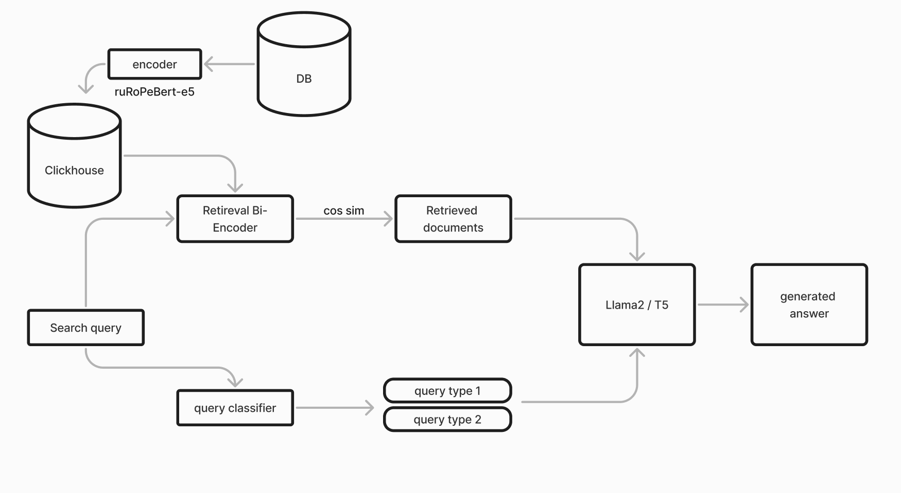

# Поиск по документам методом RAG


### [Сбор  данных](https://github.com/EgorTarasov/Purple-hack/blob/main/ml/main.ipynb)
В качестве датасета выступили данные доступные на сайте [Центрального банка](https://cbr.ru) . Сбор данных начинался с изучения работы сайта и устройства существующего поиска. После анализа трафика и результатов поиска выявили следующие моменты:
- API поиска `https://www.cbr.ru/search/` с параметрами
	- Text: "Запрос поиска"
	- PageNum: пагинация по результатам поиска
	- Category: тип материала (нововсти / пресс релизы)
	- Time: фильтр по времени
- API новостей: `https://www.cbr.ru/news/eventandpress/` с query параметрами:
	- page: int -  пагинация по результатам поиска
	- IsEng: bool -  вывод результатов на английском языке 
	- type: int тип новость / пресс релиз
	- dateFrom:  начало временного отрезка по которому происходит поиск
	- dateTo: конец временого отрезка по которому происходит поиск
	- Tid: ?
	- vol: ?
	- phrase: поиск по фразе в новостях
Так же по результатам тестовых запросов выявили две ссылки по которым можно получить отцифрованные документы в формате pdf:
- Документы центрального банка: https://www.cbr.ru/Queries/UniDbQuery/File/90134/<fileID>
- Документы содержащие правовую информацию https://www.cbr.ru/

Из интересных данных так же отметили раздел [часто задаваемых вопросов](https://cbr.ru/faq/). Для его парсинга написали простую [утилитку на го](https://github.com/EgorTarasov/Purple-hack/blob/main/faq-parser/parser.go), с помощью которой пробежались по сложной вложенной структуре категорий и вопров и сохранили их во временное хранилище

все оригинальные документы хранятся на [гугл диске](https://drive.google.com/drive/folders/1vwb7mv04PcE3FNT0Xj4rA_HcKgH2Azyk?usp=sharing) 
### Обработка
В качестве временного хранилища для текстовых данных используется MongoDB. Так как документо орентированые бд позьволяют хранить данные без определенной структуры.

После обработки pdf документов, которые были созданы в текстовых редакторах. Для пополнения набора данных использовалась модель [easyocr]() для обработки текста с изображений для дальнейшей обработки. В процессе экстракции текстов с отсканированных документов обнаружились проблемы, с горизонтальными таблицами расположенными в вертикальном документе вот несколько примеров:

170-173 страница - https://www.cbr.ru/Queries/UniDbQuery/File/90134/2726

### [Энкодинг текстовых данных](https://github.com/EgorTarasov/Purple-hack/blob/main/ml/tochka.ipynb)
Перед кодированием мы создаем исскуственное пересечение контекстом, чтобы во время поиска мы могли выдавать два [материала](https://github.com/EgorTarasov/Purple-hack/blob/main/ml/document.py) с релевантными данными. 
Благодаря использованию Tochka-AI/ruRoPEBert-e5-base-2k с увеличеным контекстом до 2 тысяч токенов, [что позволило сделать overlap в 490 токенов](https://github.com/EgorTarasov/Purple-hack/blob/main/ml/textsplitter.py). Эта модель является русифицированной версией intfloat/multilingual-e5-base, полученной путем удаления лишних токенов из других языков. Что позволяет пересчитывать embeddings для всех материалов в районе 8-9 минут на gpu. 

### [Retrieval Bi-encoder](https://github.com/EgorTarasov/Purple-hack/blob/main/ml/store.py)
Для векторного поиска по документам мы используем распределенное векторное хранилище Clickhouse. Для этого был написан собственный класс VectorStore, который выполняет следующие функции:
- создание таблицы 
- создание эмбеддингов
- поиск ближайших документов к запросу


### [LLM](https://github.com/EgorTarasov/Purple-hack/tree/main/python-backend)
После получения ранжированного списка семантически близких документов к запросу, мы передаем их вместе с специальным промптом в две модели - LLama2 и T5-FRED. LLama2 запускается из библиотеки Ollama и была дополнительно донастроена с использованием библиотеки UnSloth.
запуск моделей можно осуществить в прототипе *для запуска в блокноте потребуется соединение с clickhouse 
промт для Llama2:
```py
template = """Отвечай только на русском. Если пишешь на другом языке, переводи его на русской.
Если не знаешь ответа, скажи что не знаешь ответа, не пробуй отвечать.
Я дам тебе три текста, из которых надо дать ответ на поставленный вопрос.
Также тебе надо оставить ссылку из источник.

Context:
источник {url1}:
{context1}

источник {url2}:
{context2}

источник {url3}:
{context3}

Вопрос: {question} на русском языке. Ответь на вопрос основываясь на данных документах
Развернутый ответ:
"""
```

промт для T5-FRED:
```py
promt = f"""
<SC6>Текст:
источник {docs[0].metadata}:
{docs[0].text}
источник {docs[1].metadata}:
{docs[1].text}
источника {docs[2].metadata}:
{docs[2].text}

Вопрос: {query} Укажи источник. Ответь на вопрос основываясь на данных документах
Развернутый ответ: <extra_id_0>
"""
```
