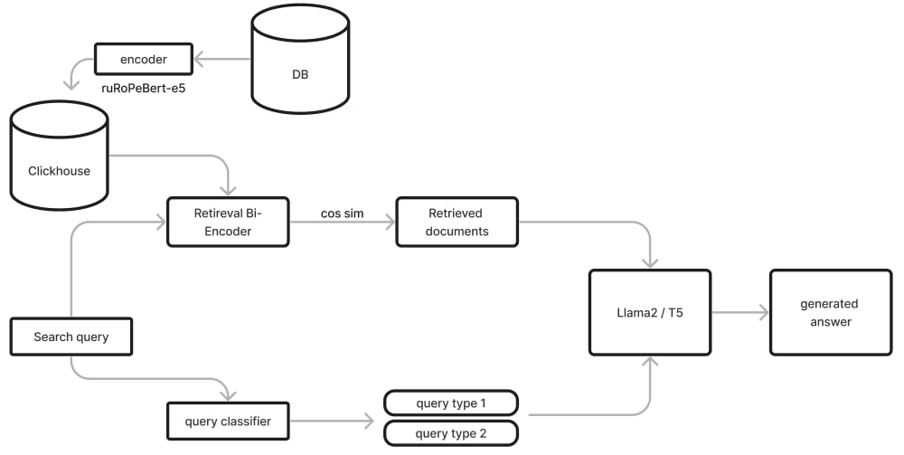

# Поиск по документам методом RAG


### Retrieval Bi-encoder
Для векторного поиска по документам мы используем распределенное векторное хранилище Clickhouse. Для этого был написан собственный класс VectorStore, который выполняет следующие функции:
- создание таблицы
- создание эмбеддингов
- поиск ближайших документов к запросу

### Энкодер
В качестве энкодера используется модель ruRoPeBert-e5-base. Эта модель является русифицированной версией intfloat/multilingual-e5-base, полученной путем удаления лишних токенов из других языков.

### LLM
После получения ранжированного списка семантически близких документов к запросу, мы передаем их вместе с специальным промптом в две модели - LLama2 и T5-FRED. LLama2 запускается из библиотеки OLLAMA и была дополнительно донастроена с использованием библиотеки UnSloth.

промт для Llama2:
```py
template = """Отвечай только на русском. Если пишешь на другом языке, переводи его на русской.
Если не знаешь ответа, скажи что не знаешь ответа, не пробуй отвечать.
Я дам тебе три текста, из которых надо дать ответ на поставленный вопрос.
Также тебе надо оставить ссылку из источник.

Context:
источник {url1}:
{context1}

источник {url2}:
{context2}

источник {url3}:
{context3}

Вопрос: {question} на русском языке. Ответь на вопрос основываясь на данных документах
Развернутый ответ:
"""
```

промт для T5-FRED:
```py
promt = f"""
<SC6>Текст:
источник {docs[0].metadata}:
{docs[0].text}
источник {docs[1].metadata}:
{docs[1].text}
источника {docs[2].metadata}:
{docs[2].text}

Вопрос: {query} Укажи источник. Ответь на вопрос основываясь на данных документах
Развернутый ответ: <extra_id_0>
"""
```